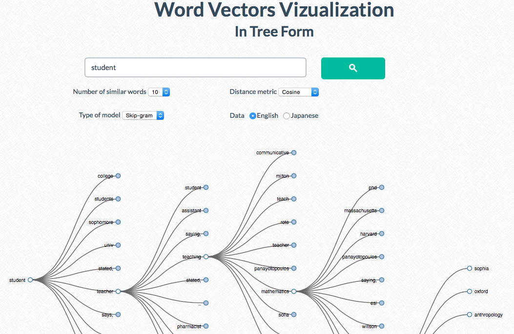
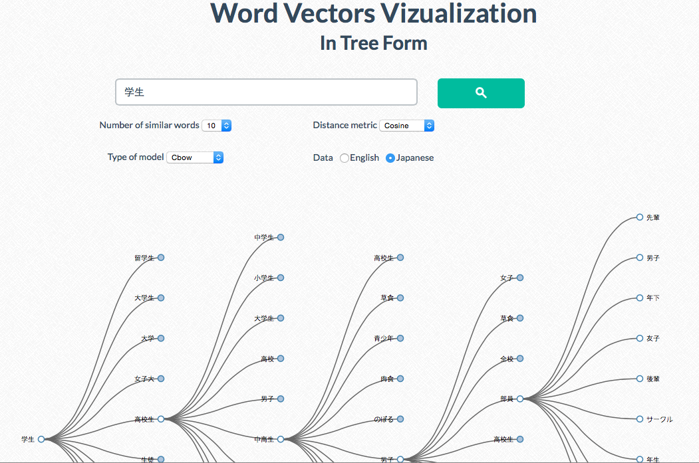

# word2vec-visualization
Word Vectors Visualization in Tree Form

Authors: Van-Thuy Phi and Taishi Ikeda.

Supervisor: Kevin Duh.

- Two types of distances: Cosine distance / Euclidean distance.
- Totally 8 different models for English and Japanese data.
- To run simple HTTP server: "python -m SimpleHTTPServer 8888".
 

 
 
 
 

 

- Main files and folders:
	+ backend 
		+ HiraganaTimes_English 
			the implementation of continuous bag-of-words and skip-gram architectures for computing vector representations of words in English; skip-gram (slower, better for infrequent words) vs CBOW (fast).
		+ HiraganaTimes_Japanese 
			the implementation of continuous bag-of-words and skip-gram architectures for computing vector representations of words in Japanese.
		+ Convert_to_JSON  
			scripts for converting word2vec models to JSON files.
	+ frontend 
		+ data 
			all data for searching word and vizualizing them: "data_cosine.json" and "data_euclidean.json" are the databases. The flare-format data is created from the database when running the web page.
		+ js 
			D3.js library (visualization javascript library).
		+ word2vec_tree_final.html 
			the main web page.

- Visualize your own data
	+ To convert the word2vec models to the JSON files, the Gensim library (https://radimrehurek.com/gensim/install.html) is required.
	Quick install Gensim: "easy_install -U gensim" or, alternatively: "pip install --upgrade gensim".
	+ For the Cosine distance metric: use the script "create_database_cosine.py".
	+ For the Euclidean distance metric: use the script "create_database_euclidean.py", and copy the file "word2vec.py" to Gensim library's location, e.g., "/Library/Python/2.7/site-packages/gensim-0.10.3-py2.7-macosx-10.10-intel.egg/gensim/models". In this new implementation, the new method most_similar_euclidean() is included to calculate the distance between pairs of words/phrases by the Euclidean metric.
	+ Special characters should be excluded from JSON files to generate the correct JSON format. More details are in "Remove_Special_Characters.txt" file.
